# MovieMint

## Overview

This application is a full-featured web-based platform developed using modern web technologies to simplify the process of booking movie tickets online.

The platform provides an impressive and responsive user interface, ensuring a seamless experience across both desktop and mobile devices. Users can create accounts, manage their bookings, and receive real-time updates on seat availability. The system also includes features like seat selection with dynamic layouts, booking history, and digital ticket generation.

On the administrative side, the application supports role-based access for admins and theater owners, enabling them to manage movies, schedules, screens, and seat configurations efficiently. Real-time data handling ensures accurate seat reservation and prevents double bookings.

Overall, this project demonstrates the integration of frontend and backend technologies to build a scalable, user-friendly, and efficient ticket booking solution.

## App Features

### User Features

- **Browser Movies:** Users can explore a list of currently running and upcoming movies with detailed information such as genre, duration, cast, and release date.

- **View Show Timings:**
    Displays available showtimes across different theaters, allowing users to choose a convenient schedule.

 - **Interactive Seat Selection:**
 Provides a dynamic seat layout where users can visually select available seats. Real-time updates ensure accurate seat availability.

 - **Digital Ticket Generation:**
Generates downloadable tickets (PDF or digital format) that can be used for entry or sharing.

 - **Booking History Management:**
 Users can view past and upcoming bookings, making it easy to track their movie plans.

### Theater Owner Features

 - **Movie Selection:**
Theater owners can select movies from the movie list which is created by admins instead of creating new ones, ensuring consistency across the platform.

 - **Show & Schedule Management:**
Allows theater owners to create multiple showtimes for each movie across different and dates, providing flexibility in scheduling.

 - **Custom Pricing per movie:**
Enables setting different ticket prices for each movie and showtime

 - **Screen & Seat Layout Configuration:**
 Theater owners can design and manage seat layouts. Enabling dynamic seat selection.

 - **Booking & Revenue Tracking:**
Provides access to booking details and earnings, helping theater owners monitor performance and occupancy.

### Admin Features

 - **Movie Management:**
 Admin can add new movies and update existing movie details.

 - **Manage Theater Requests:**
 Admin can approve or reject theater registration requests.

 - **Manage Theaters:**
 Admin can view and control all registered theaters on the platform.

## System & Architecture Features

 - **Microservice Architecture:**
 The application is designed using a microservices-based architecture, where core functionalities (such as authentication, booking, notifications, and media handling) are separated into independent services. This improves scalability, maintainability, and allows independent deployment of each service.

 - **Multi-Container Deployment with Docker:**
 The system uses Docker for containerization, with each service running in its own container. This ensures consistency across development and production environments, simplifies deployment, and enables easy scaling of individual services.

 - **Background Task Processing:**
 Supports asynchronous background jobs for handling non-blocking operations such as sending notifications and processing system events efficiently.

 - **Real-Time Communication (WebSockets):**
Implements WebSocket-based communication to enable real-time updates for seat availability, ensuring users see instant changes when seats are selected or booked by others.

 - **Movie Release Notification System:**
Implements scheduled background tasks to notify users when a movie is released or becomes available for booking, enhancing user engagement.

 - **Pagination & Efficient Data Handling:**
 Uses pagination to efficiently manage and serve large datasets like movies, bookings for improving performance and reducing load times.

 - **Multiple Frontend Applications:**
 The platform includes separate frontend applications for:

    * App – for browsing and booking tickets 
    
    * Admin Dashboard – for managing movie details and theaters 

    * Theater Dashboard – for managing shows and pricing 
    
    This separation ensures better user experience and role-based access control.

 - **MVC Architecture:**
 The project follows the Model-View-Controller pattern, which separates business logic, UI, and data handling. This makes the application more scalable, maintainable, and easy to manage.

 - **Independently Scalable Frontend & Services:**
Both frontend applications and backend services can be scaled independently based on traffic and usage, making the system highly flexible and efficient.

## Technologies

 - **Frontend:**
    React, Next js, Redux, Vite, Typescript, Tailwind CSS, CSS, Sass, Axios, React Router (For React navigation), Zod (For validation), Lucid React (For icons), Shadcn (For components), React Hook Form (For form validation)

 - **Backend:**
    Fastify, Express js, Hono js, Node js, Bun js, Typescript, Sequelize, Mongoose, Bullmq (For background tasks), Zod (For validation), Multer (For multiformdata data), Nodemailer (For mail service)

 - **Database:**
    Mongodb, Postgresql, Redis

 - **Media & Storage:**
    Supabase (Cloud storage for media)

 - **DevOps & Deployment:**
    Docker (Multi-container microservices setup)

 - **Development & Automation:**
    Bash script

 - **Version Control & Collaboration:**
    Git, Github

 - **Package Manager:**
    PNPM, NPM, Bun

## Get Started

### Cloning Project

```bash
git clone https://github.com/Midhun-u/MovieMint.git
cd MovieMint

# Must create .env file for all client server then add api keys and other variables according to .env.sample file
```

### Installing Dependencies

#### Frontend Installation

* Admin Dashboard
```bash
# Installing admin dashboard dependencies
cd ./clients/admin-dashboard
pnpm install
pnpm run dev
```
* App
```bash
# Installing app dependencies
cd ./clients/app
npm install
npm run dev
```
* Theater Dashboard
```bash
# Installing theater dashboard dependencies
cd ./clients/theater-dashboard
bun install
bun run dev
```

#### Backend Installation

* Authentication Service
```bash
# Installing auth service dependecies
cd ./services/auth-service
npm install 
npm run dev
```
* Bookings Service
```bash
# Installing bookings service dependecies
cd ./services/bookings-service
pnpm install
pnpm run dev
```
* Media Service
```bash
# Installing media service dependecies
cd ./services/media-service
npm install
npm run dev
```
* Movie Service
```bash
# Installing movie service dependecies
cd ./services/movie-service
bun install
bun run dev
```

* For running movie worker
```bash
# Running movie worker
cd ./services/movie-service
bun run movie-worker
```
* Notification Service
```bash
# Installing notification service dependecies
cd ./services/notification-service
bun install
bun run dev
```

* For running notification worker
```bash
# Running notification worker
cd ./services/notification-service
bun run notification-worker
```
* Theater Service
```bash
# Installing theater service dependecies
cd ./services/theater-service
bun install
bun run dev
```

### Running Containers

#### Frontend

* Admin Dashboard
```bash
# Running admin dashboard container
cd ./clients/admin-dashboard
sudo docker build -t admin_dashboard ./
sudo docker run --network=host -p 8000:80 admin_dashboard
```

* For running Bash Script in admin dasbhboard
```bash
cd ./clients/admin-dashboard
chmod u+x ./container.bash # Or chmod 744 ./continer.bash
./container.bash
```

* App
```bash
# Running app container
cd ./clients/app
sudo docker build -t app ./
sudo docker run --network=host -p 8000:80 app
```
* For running Bash Script in app
```bash
cd ./clients/app
chmod u+x ./container.bash # Or chmod 744 ./continer.bash
./container.bash
```

* Theater Dashboard
```bash
# Running theater dashboard container
cd ./clients/theater-dashboard
sudo docker build -t theater_dashboard ./
sudo docker run --network=host -p 8080:80 theater_dashboard
```

* For running Bash Script in theater dashboard
```bash
cd ./clients/theater-dashboard
chmod u+x ./container.bash # Or chmod 744 ./continer.bash
./container.bash
```

### Backend 
* Authentication Service
```bash
cd ./services/auth-service
sudo docker build -t auth_service ./
sudo docker run --network=host auth_service
```

* For running Bash Script in authentication service
```bash
cd ./services/auth-service
chmod u+x ./container.bash # Or chmod 744 ./continer.bash
./container.bash
```

* Bookings Service
```bash
cd ./services/bookings-service
sudo docker build -t bookings_service ./
sudo docker run --network=host bookings_service
```
* For running Bash Script in bookings service
```bash
cd ./services/bookings-service
chmod u+x ./container.bash # Or chmod 744 ./continer.bash
./container.bash
```
* Media Service
```bash
cd ./services/media-service
sudo docker build -t media_service ./
sudo docker run --network=host media_service
```
* For running Bash Script in media service
```bash
cd ./services/media-service
chmod u+x ./container.bash # Or chmod 744 ./continer.bash
./container.bash
```

* Movie Service
```bash
cd ./services/movie-service
sudo docker build -t movie_service ./
sudo docker run --network=host movie_service
```
* For running Bash Script in movie service
```bash
cd ./services/movie-service
chmod u+x ./container.bash # Or chmod 744 ./continer.bash
./container.bash
```

* For running movie worker
```bash
cd ./services/movie-service
sudo docker build -t movie_worker ./
sudo docker run --network=host movie_worker bun run movie-worker
```

* Notification Service
```bash
cd ./services/notification-service
sudo docker build -t notification_service ./
sudo docker run --network=host notification_service
```

* For running Bash Script in notification service
```bash
cd ./services/notification-service
chmod u+x ./container.bash # Or chmod 744 ./continer.bash
./container.bash
```

* For running notification worker
```bash
cd ./services/movie-service
sudo docker build -t movie_worker ./
sudo docker run --network=host movie_worker bun run notification-worker
```

* Theater Service
```bash
cd ./services/theater-service
sudo docker build -t theater_service ./
sudo docker run --network=host theater_service
```

* For running Bash script in theater service
```bash
cd ./services/theater-service
chmod u+x ./container.bash # Or chmod 744 ./continer.bash
./container.bash
```

## Preview
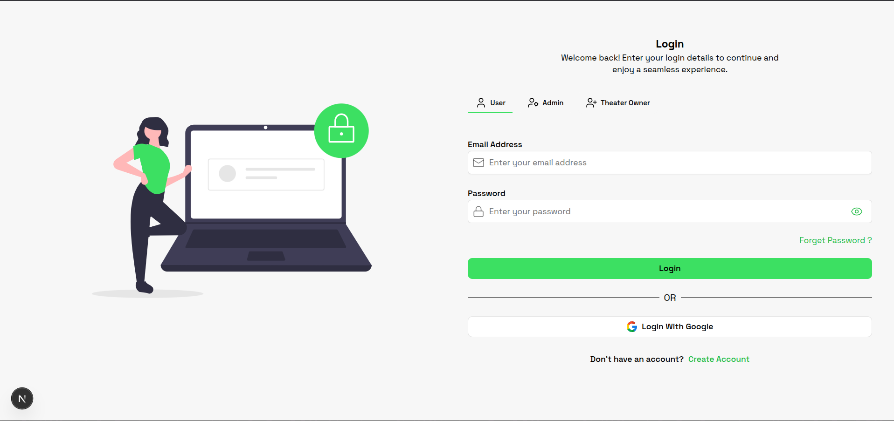
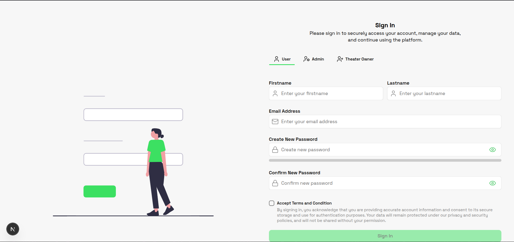
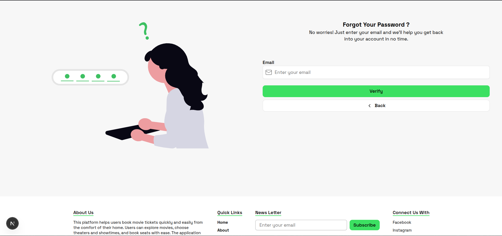
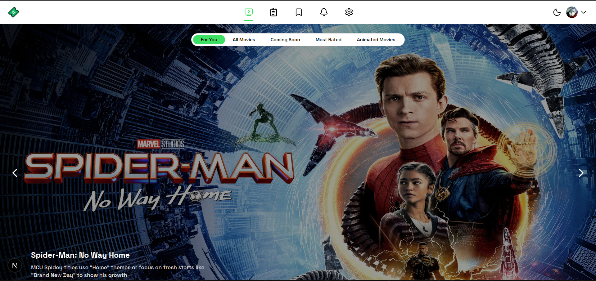
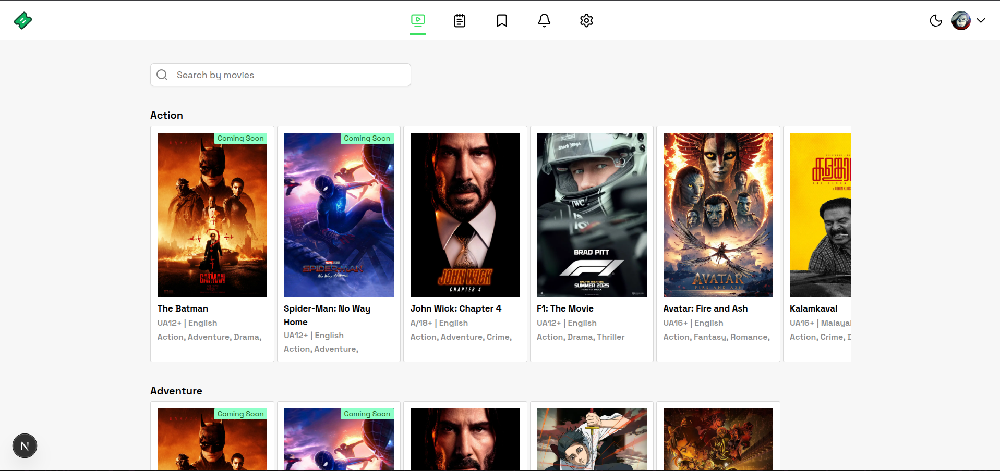
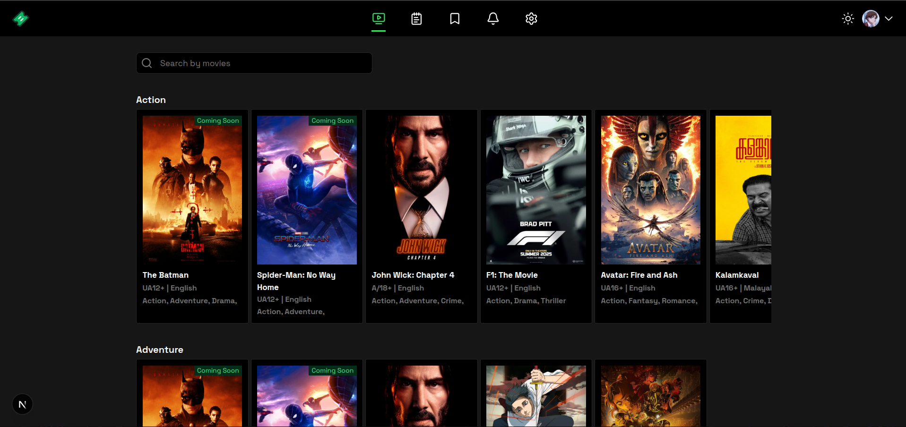
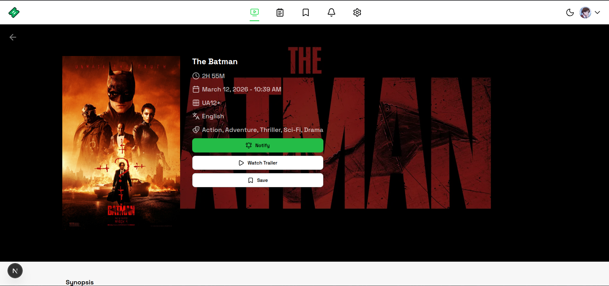
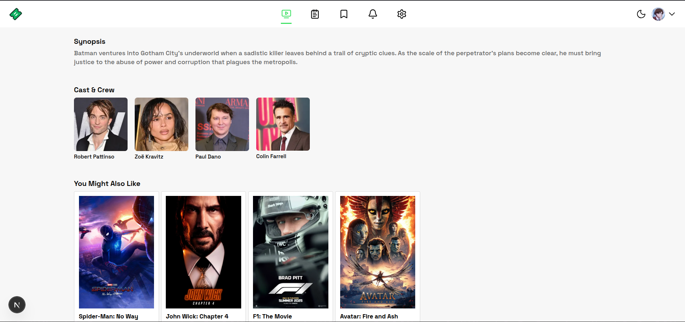
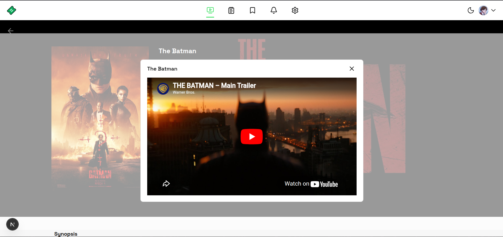
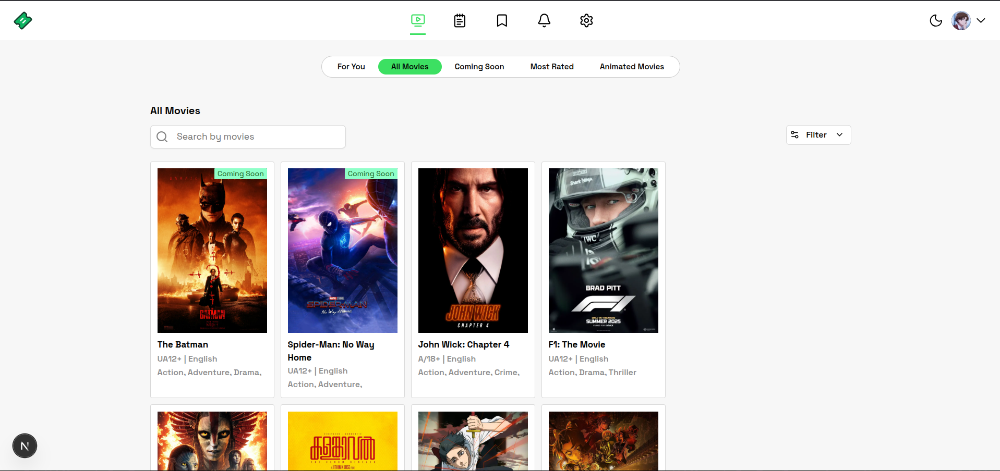
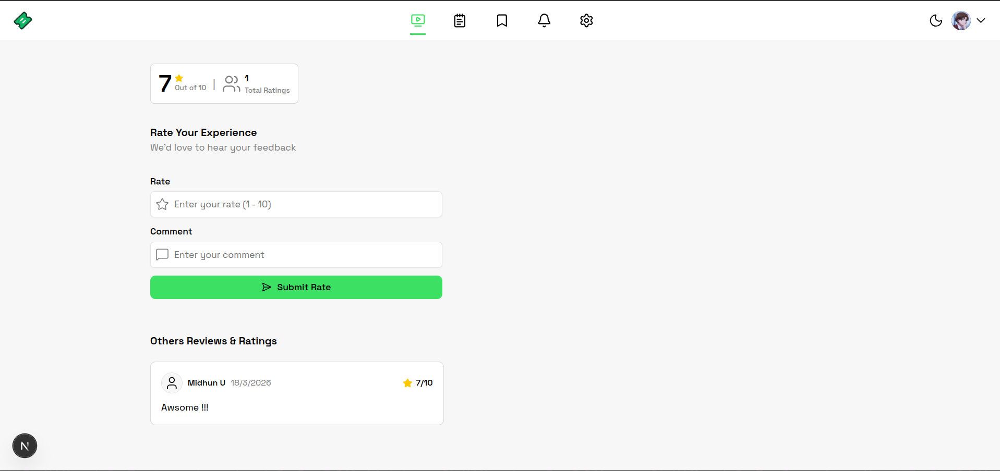
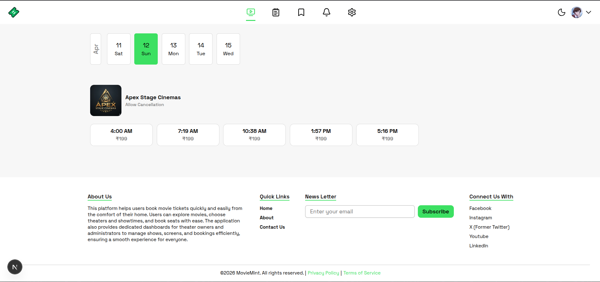
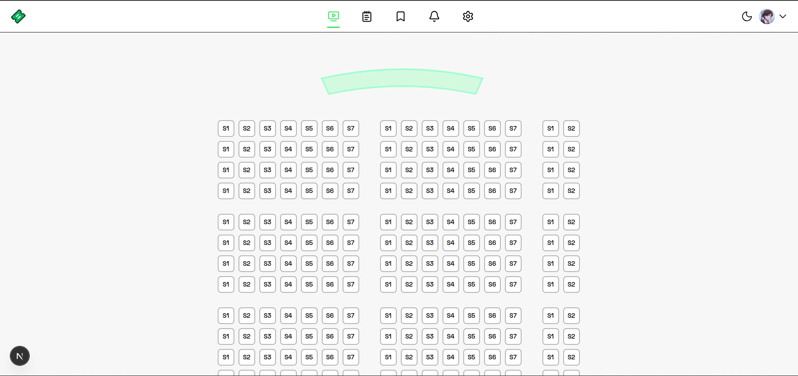
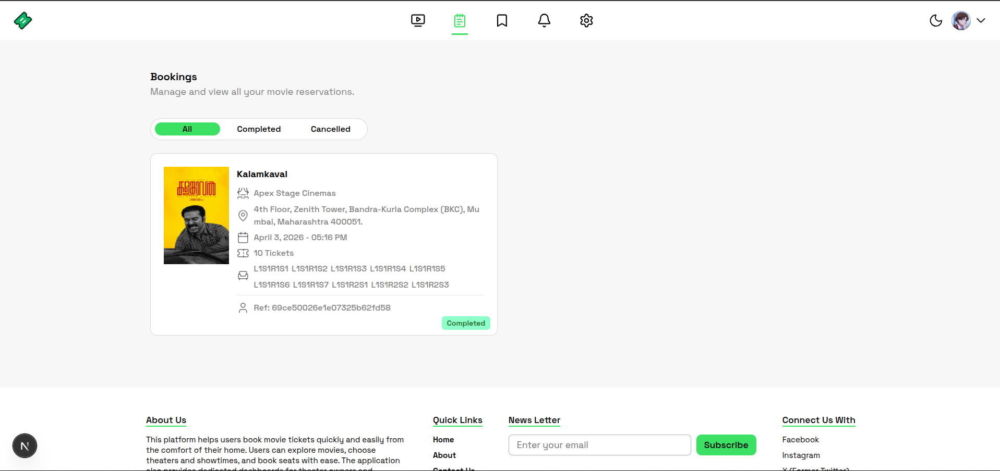
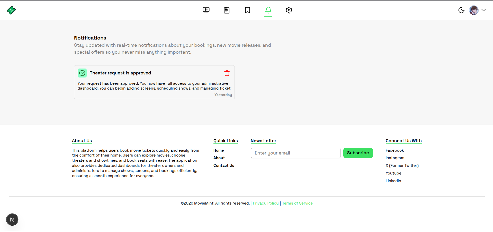
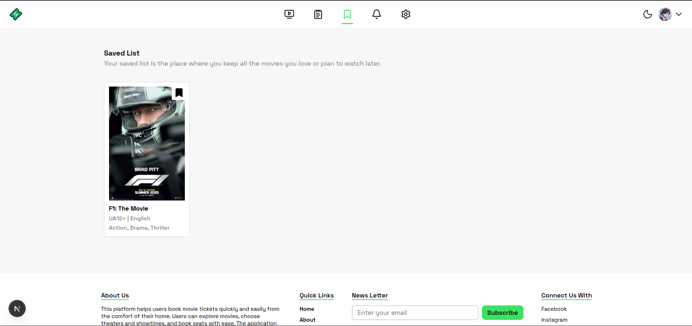
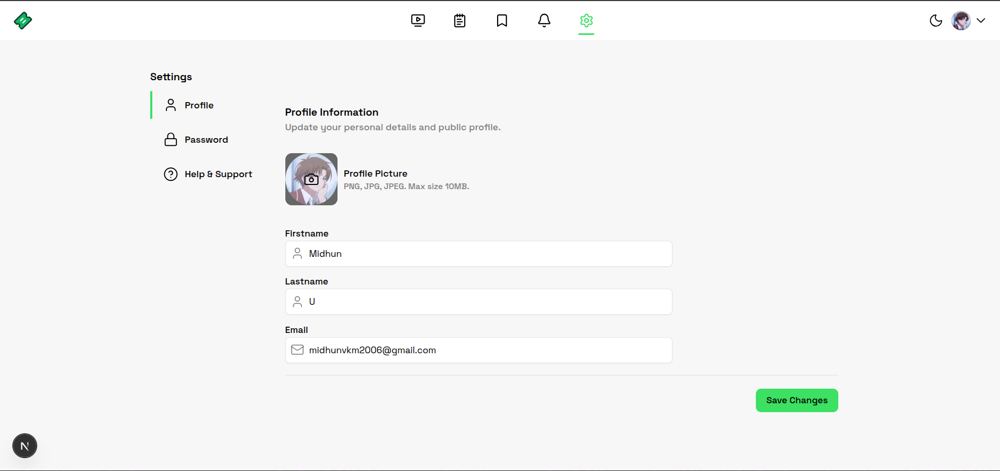